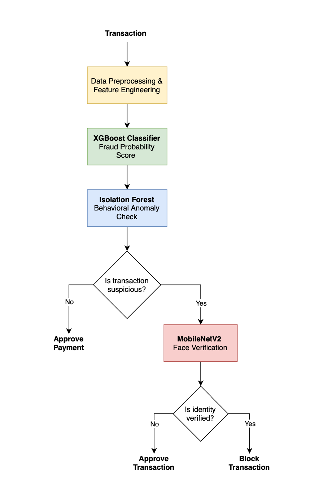
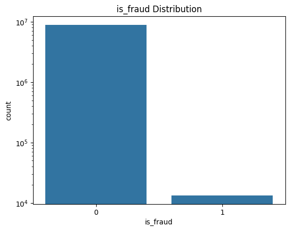
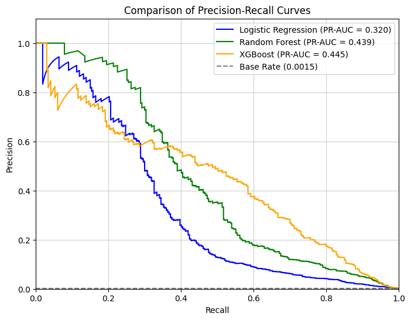
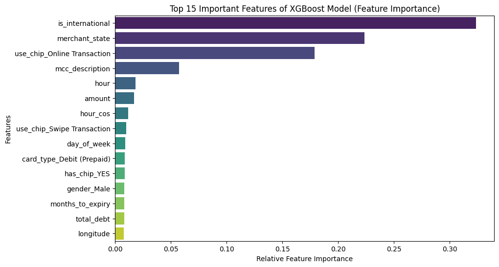
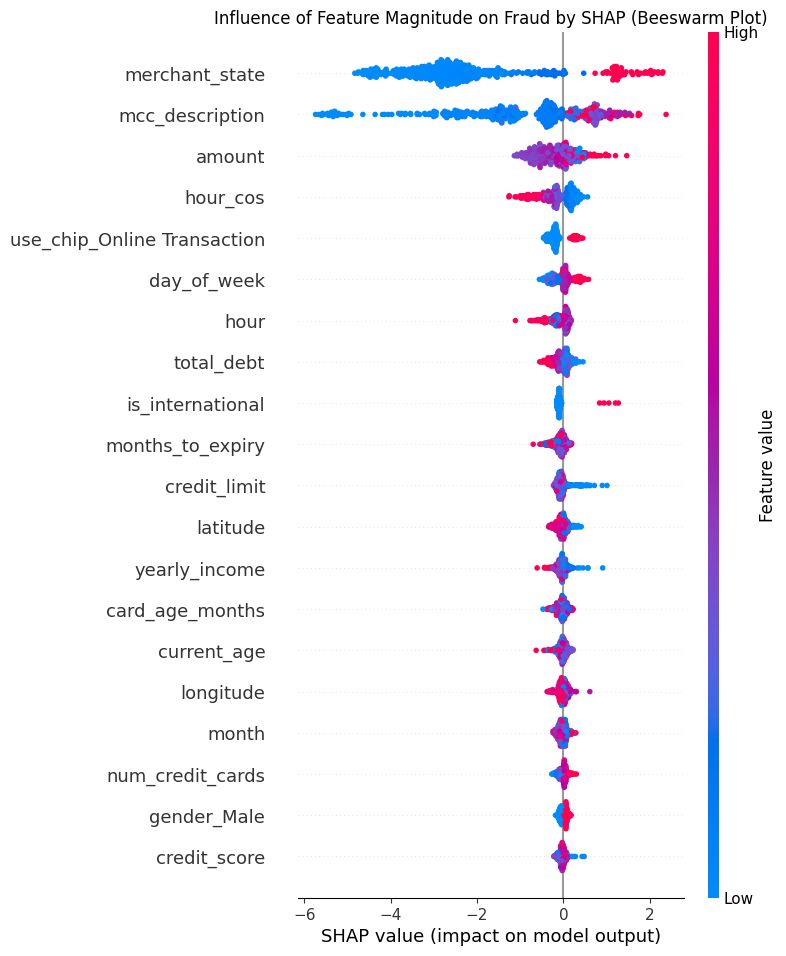
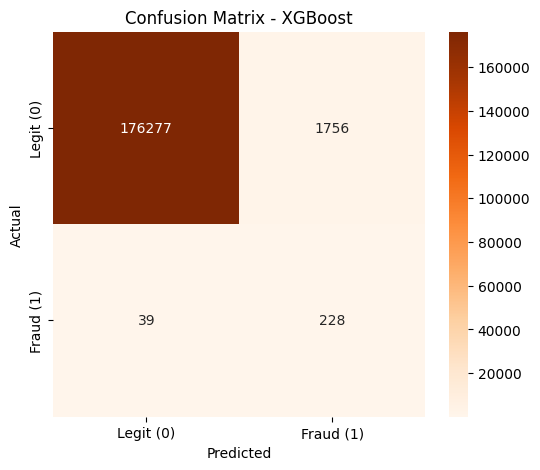

# Banking Fraud Detection System

An end-to-end machine learning pipeline for detecting fraudulent banking transactions using supervised learning, anomaly detection, and biometric identity verification.

## Overview

Project Goal: Build a three-stage system for detecting fraudulent transactions that includes:

- Fraud probability estimation using XGBoost
- Behavioral anomaly detection using Isolation Forest
- Biometric identity verification using MobileNetV2

Practical Focus: Direct protection of fintech products and customers from financial losses. The system must detect suspicious transactions in real time, while minimizing manual verification and preventing unnecessary delays for legitimate users.

### Architecture

## Dataset

### Financial Transactions Dataset

- 13M+ transactions
- 6K+ payment cards
- 2K+ customers
- 41 features

The dataset contains:

- transaction amount
- merchant information
- MCC codes
- transaction timestamps
- geographic information
- customer demographics
- card information
- fraud labels

Target Class Distribution

Dataset source:
https://www.kaggle.com/datasets/computingvictor/transactions-fraud-datasets

### Face Recognition Dataset

Used for the biometric verification stage. Contains celebrity face images. Brad Pitt was selected as a sample cardholder for demonstration purposes.

Dataset source:
https://www.kaggle.com/datasets/vasukipatel/face-recognition-dataset

## Pipeline

### Data Preprocessing

- merged multiple transaction tables
- parsed JSON fraud labels and MCC descriptions
- handled missing values
- converted monetary values to numeric format
- transformed date features
- removed duplicate columns
- created unified customer and transaction views

### Exploratory Data Analysis

Performed extensive EDA to understand fraud patterns.

Key findings:

- severe class imbalance
- online transactions are significantly riskier
- international transactions have higher fraud rates
- fraud is more frequent during specific hours
- transaction amount is an important anomaly indicator
- numerical features have weak linear correlations, motivating tree-based models

### Feature Engineering

Created additional predictive features including:

- hour (cyclical encoding)
- day of week
- month
- card age
- months until card expiration
- international transaction flag
- temporal features
- merchant-based features

Categorical variables were encoded using:

- Target Encoding
- One-Hot Encoding

### Model Comparison

Three classification models were trained and compared.

| Model                   | Recall  |  ROC-AUC  |  PR-AUC   |
| :---------------------- | :-----: | :-------: | :-------: |
| **Logistic Regression** |   66%   |   0.969   |   0.363   |
| **Random Forest**       |   79%   |   0.982   |   0.439   |
| **XGBoost**             | **85%** | **0.986** | **0.445** |

XGBoost achieved the best overall performance and was selected as the primary fraud detection model.

### Hyperparameter Optimization

Hyperparameters were optimized using **RandomizedSearchCV**.

**Improvement**
| Model | PR-AUC (Before Tuning) | PR-AUC (After Tuning) | Metric Improvement |
| :---------------- | :---: | :---: | :---: |
| **Random Forest** | 0.439 | 0.445 | +0.006 |
| **XGBoost** | **0.445** | **0.485** | **+0.04** |

### Model Explainability

Model explainability was performed using **SHAP**.

Main influential features:

- International transaction
- Merchant location
- Merchant category (MCC)
- Online payment
- Transaction amount
- Transaction hour

This analysis improves model transparency and helps explain fraud predictions.

### Anomaly Detection

Implemented **Isolation Forest** trained only on legitimate transactions.

Purpose:

- detect previously unseen fraud patterns
- identify abnormal customer behavior
- provide an additional security layer beyond supervised learning

Although Isolation Forest showed lower recall than XGBoost, it can identify novel attack scenarios not present in historical labels.

### Biometric Verification

A CNN based on **MobileNetV2** performs identity verification.

Workflow:

- suspicious transaction detected
- user is prompted for Face ID
- MobileNetV2 verifies identity
- transaction is approved or blocked

This demonstrates how computer vision can complement classical fraud detection systems.

## Results

- Processed 13M+ financial transactions
- Built an end-to-end fraud detection pipeline
- Achieved 85% fraud recall
- Achieved 0.986 ROC-AUC
- Improved PR-AUC from 0.445 to 0.485 after hyperparameter tuning
- Interpreted predictions using SHAP
- Added behavioral anomaly detection
- Added biometric identity verification

## Tech Stack

**Programming**

- Python

**Data Processing**

- pandas
- NumPy

**Visualization**

- Matplotlib
- Seaborn

**Machine Learning**

- Scikit-learn
- XGBoost

**Explainability**

- SHAP

**Deep Learning**

- TensorFlow
- Keras
- MobileNetV2
